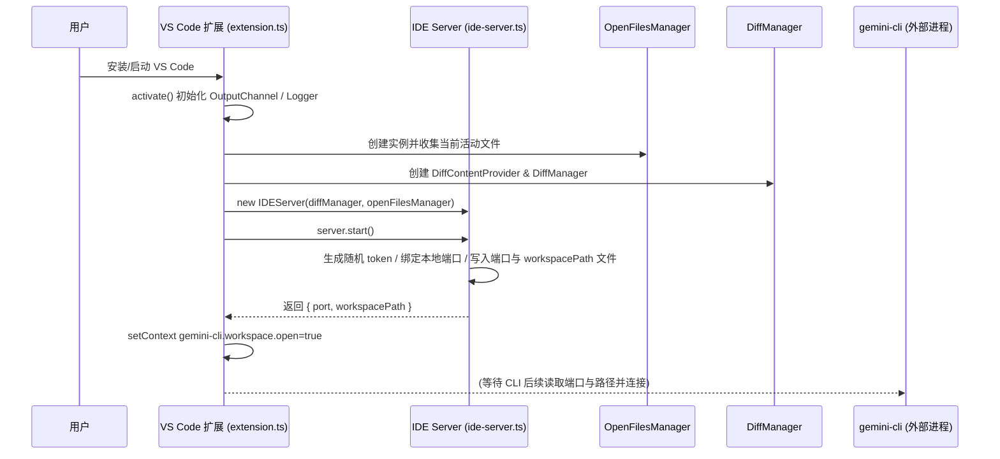
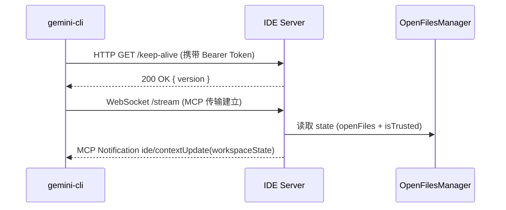
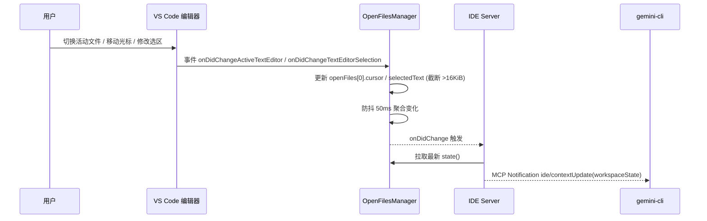
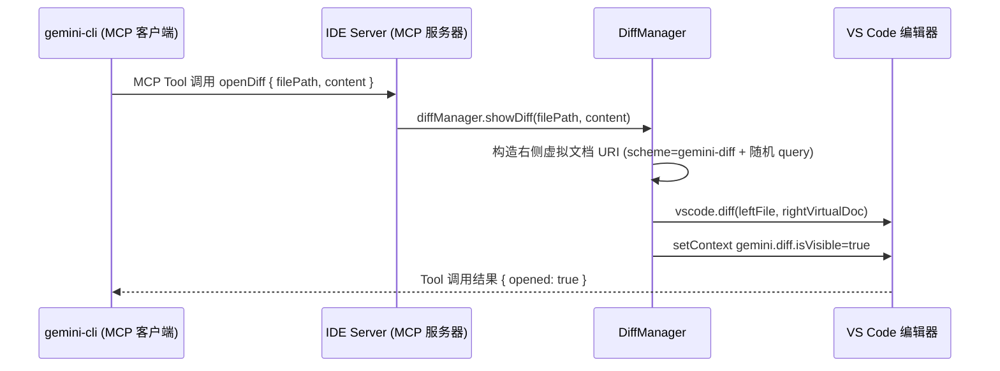
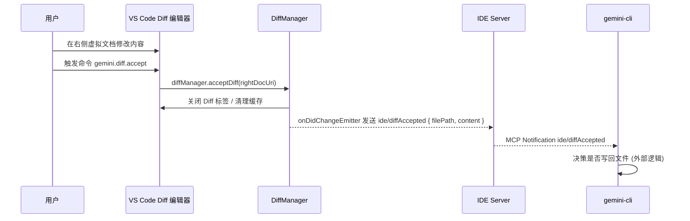
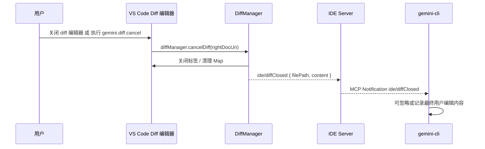
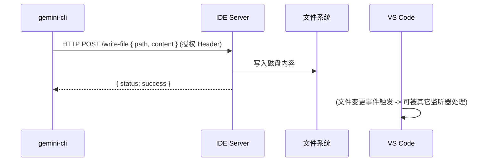

# Gemini CLI IDE Companion 交互时序图

本文档展示 VS Code 扩展与本地 IDE
Server、CLI 以及 Diff 管理与文件上下文跟踪之间的核心交互流程。所有步骤均基于当前实现的
`extension.ts`、`ide-server.ts`、`diff-manager.ts`、`open-files-manager.ts`。

## 场景 1：扩展激活与服务器启动

## 场景 2：CLI 连接并获取 IDE 上下文

## 场景 3：用户编辑 / 光标 / 选区变更触发上下文更新

## 场景 4：CLI 请求打开 Diff（代码建议）

## 场景 5：用户在 Diff 中编辑并接受修改

## 场景 6：用户取消或直接关闭 Diff

## 场景 7：CLI 发起写文件操作（外部逻辑，可选）

## 组件职责概述 (中文速览)

- VS Code 扩展 (`extension.ts`): 负责初始化、注册命令、启动本地 IDE
  Server、协调 Diff 与上下文广播。
- IDE Server (`ide-server.ts`): 基于 Express +
  MCP，暴露工具 (openDiff/closeDiff)，广播 ide/contextUpdate、diffAccepted/diffClosed 等通知。
- DiffManager: 管理 diff 虚拟文档生命周期，用户接受/取消后发射通知。
- OpenFilesManager: 跟踪最近活动文件、光标、选区（带截断），防抖聚合后触发上下文更新。
- CLI (`gemini-cli`): 连接 IDE
  Server，消费上下文通知，调用工具生成/关闭 diff，基于用户反馈执行写回等操作。

## 关键交互要点

1. 身份验证：HTTP 请求需 Bearer Token（随机 UUID）确保仅本地受信进程访问。
2. 上下文同步：OpenFilesManager 防抖输出，IDE
   Server 拉取并广播，CLI 持有最新工作区状态用于生成建议。
3. Diff 机制：右侧虚拟文档使用自定义 scheme + 随机 query 避免缓存；关闭或接受差异时都提供最终内容回传。
4. 选区截断：超过 16KiB 选中文本自动截断并加尾标识，避免上下文过大影响模型性能或传输。
5. 条件日志：仅在开发模式或用户开启 debug 配置时输出，保证生产环境整洁。

---

如需补充“错误处理流程”或“并发/冲突”场景的时序图，请继续说明，我可以再添加扩展章节。
